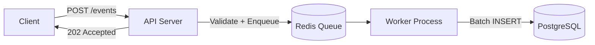
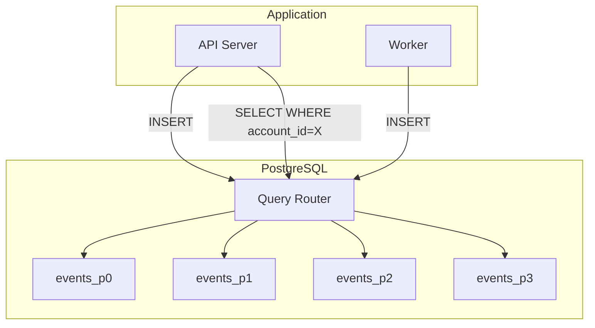
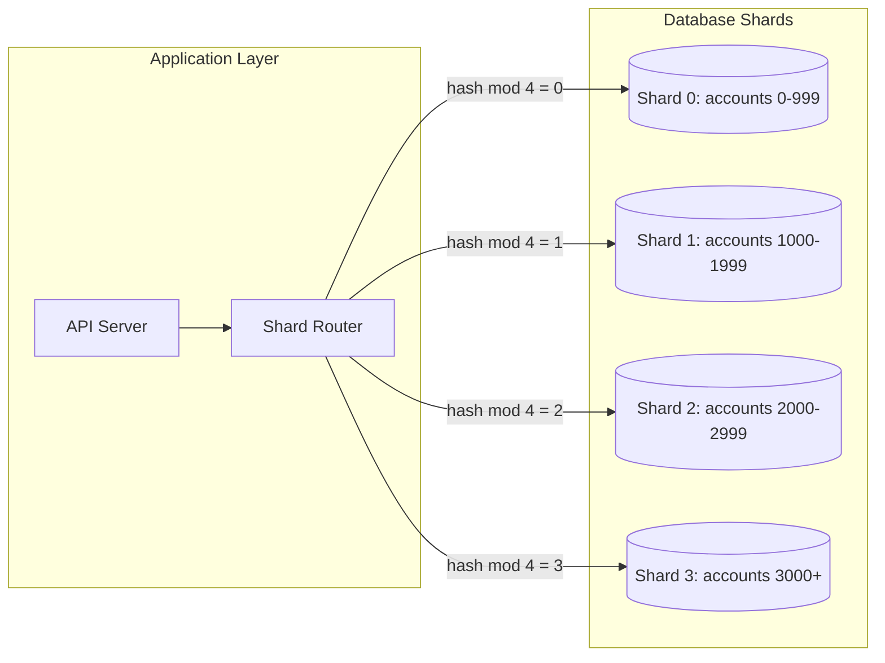

# Design Document: Event Ingestion Platform

## 1. Introduction

This document outlines the design decisions for a write-heavy event ingestion service with read-heavy analytics. The system accepts events from multiple accounts (tenants), stores them in PostgreSQL, and provides real-time summaries.

### What this document covers

- The core problems we identified and how we addressed them
- Design decisions with their trade-offs
- What's implemented vs planned vs intentionally deferred
- Assumptions we're making that a reviewer should be aware of

### Core problems we're solving

1. **High write volume with unpredictable spikes** — Bursts of events shouldn't block HTTP responses or crash the system
2. **Read-heavy analytics competing with writes** — Summary queries shouldn't slow down ingestion
3. **Multi-tenant fairness** — One "whale" account shouldn't degrade service for others
4. **Reliability without over-engineering** — Graceful degradation, not perfect uptime

---

## 2. Problem Statement & Constraints

### The Problem

We need to ingest events at high volume (thousands per minute) while serving analytics queries. The system is multi-tenant: some accounts generate far more traffic than others. A naive implementation would have:

- Slow HTTP responses during DB slowdowns
- Summary queries blocking writes (or vice versa)
- One busy account degrading the experience for everyone
- No visibility into system health or SLO breaches

### Constraints

| Constraint | Implication |
|------------|-------------|
| Single-region deployment | No geo-distribution; latency is bounded by region |
| PostgreSQL as primary store | ACID guarantees but limited write throughput vs NoSQL |
| Redis available | Can use for caching and queuing |
| No strict ordering required | Events don't need to be processed in exact arrival order |
| Analytics tolerate staleness | Summaries can be up to 60 seconds stale |
| Multi-tenant, shared infrastructure | Must isolate tenants from each other's load |

---

## 3. Design Decisions

### 3.1 Async Event Ingestion with BullMQ

**Problem:** Synchronous writes block the HTTP response. If the database is slow (high load, network hiccup), clients experience high latency or timeouts. This creates a cascade: slow DB → slow API → client retries → more load → slower DB.

**Decision:** Use a Redis-backed job queue (BullMQ). The API validates the payload, enqueues a job, and returns `202 Accepted` immediately. Background workers consume jobs and batch-insert into PostgreSQL.



**Impact:**

| Benefit | Trade-off |
|---------|-----------|
| HTTP latency decoupled from DB latency | Events not immediately visible (queue delay) |
| Queue absorbs traffic spikes | Requires Redis; adds operational complexity |
| Failed jobs retry automatically | Must handle duplicate delivery (idempotency) |
| Workers can scale independently | No strict ordering across workers |

**Status:** Implemented. `POST /events` returns 202; `EventsProcessor` handles background inserts.

---

### 3.2 Redis Caching for Read-Heavy Summaries

**Problem:** The `GET /accounts/:id/summary` endpoint aggregates events by type and top users. Without caching, every request hits the database with GROUP BY queries. Under load, this competes with writes and increases latency.

**Decision:** Cache summary responses in Redis with a 60-second TTL. Cache key: `summary:{account_id}:{window}`.

**Impact:**

| Benefit | Trade-off |
|---------|-----------|
| Repeated reads served from cache | Data can be up to 60s stale |
| DB load reduced significantly | Cache invalidation not implemented (TTL-based only) |
| P95 latency drops for hot accounts | Cold accounts still hit DB |

**Status:** Implemented. `CacheService` handles get/set with TTL.

---

### 3.3 Tenant Isolation & Hotspot Prevention

**Problem:** A single "whale" account can dominate resources:
- High event volume saturates write capacity
- Frequent summary requests exhaust cache and DB connections
- Other tenants experience degraded latency

**Decision:** Multiple layers of isolation:

| Layer | Implementation | Status |
|-------|----------------|--------|
| Per-account caching | Cache keys include `account_id`; hot accounts get cache hits | Implemented |
| Global rate limiting | ThrottlerGuard limits requests per IP | Implemented |
| Per-account rate limiting | Limit events/min per `account_id` in Redis | Planned |
| DB sharding by account | Partition `events` table by `account_id` | Deferred |

**Impact:**

| Benefit | Trade-off |
|---------|-----------|
| Whales can't monopolize shared resources | Rate limits may reject legitimate traffic |
| Fairness across tenants | Per-account limits add Redis overhead |
| Sharding provides hard isolation | Sharding adds operational complexity |

**Status:** Partially implemented. Per-account caching works; per-account rate limits are planned.

---

### 3.4 Horizontal Scaling

**Problem:** A single worker process becomes a bottleneck. If event volume exceeds what one worker can process, the queue grows unbounded.

**Decision:** BullMQ natively supports multiple workers competing for jobs. Scaling options:

| Approach | How it works |
|----------|--------------|
| Multiple app instances | Each instance runs a worker; Redis distributes jobs |
| Dedicated worker nodes | Separate deployment for workers (no HTTP server) |
| Concurrency per worker | BullMQ `concurrency` option (e.g., 5 jobs in parallel) |
| Auto-scaling | Scale pods based on queue depth (Kubernetes HPA) |

**Impact:**

| Benefit | Trade-off |
|---------|-----------|
| Linear scaling of throughput | More workers = more DB connections |
| Workers are stateless; easy to add/remove | No ordering guarantees across workers |
| Queue depth is observable | Requires monitoring infrastructure |

**Status:** Architecture supports horizontal scaling. Currently single-node; multi-node deployment is straightforward.

---

### 3.5 Reliability Patterns

**Problem:** Transient failures (DB hiccups, network issues) shouldn't cause permanent data loss or cascading failures.

**Decision:** Multiple reliability patterns:

| Pattern | Implementation | Status |
|---------|----------------|--------|
| Retry with backoff | `withRetry()` helper: 3 attempts, exponential backoff | Implemented |
| Request timeout | `TimeoutInterceptor`: 15s timeout on endpoints | Implemented |
| Queue-based durability | Jobs persist in Redis; survive app restarts | Implemented |
| Idempotent writes | `orIgnore()` on `event_id` conflict | Implemented |

**Impact:**

| Benefit | Trade-off |
|---------|-----------|
| Transient failures don't lose data | Retries can delay processing |
| Timeouts prevent hung requests | Legitimate slow requests are killed |
| Idempotency handles duplicates | Requires unique `event_id` from client |

**Status:** Implemented.

---

## 4. What's Not Addressed (Deferred)

These items are intentionally deferred. They add complexity that isn't justified at current scale:

| Item | Why Deferred |
|------|--------------|
| **Per-account rate limiting** | Global IP limits sufficient for now; per-account adds Redis overhead |
| **DB sharding by account** | Single PostgreSQL handles current load; sharding is a major migration |
| **SLO dashboards & alerting** | Requires Prometheus/Grafana setup; see [Appendix B](#appendix-b-exposing-slos-to-product--business) for plan |
| **Dead-letter queue (DLQ)** | Failed jobs currently retry 3x then drop; DLQ needed for production |
| **Strict event ordering** | Not a requirement; would require partitioning by account |
| **Priority queues** | All accounts treated equally; tiering is a product decision |

---

## 5. Assumptions & Trade-offs

### Assumptions

| Assumption | If Wrong... |
|------------|-------------|
| Events don't need real-time visibility | Clients may see stale data; queue delay is observable |
| 60s cache staleness is acceptable | Analytics users see outdated numbers; reduce TTL or add invalidation |
| Single-node handles current load | Add workers or shard earlier than planned |
| Clients provide unique `event_id` | Duplicates won't be caught; add server-side UUID generation |
| Redis is reliable | Queue and cache both fail; add Redis Sentinel/Cluster |

### Trade-offs We're Living With

| Trade-off | Why We Chose This |
|-----------|-------------------|
| Eventual consistency over strong consistency | Simplicity; analytics don't need real-time accuracy |
| Simplicity over strict ordering | No business requirement for ordering; enables horizontal scaling |
| TTL-based cache over invalidation | Simpler implementation; 60s staleness is acceptable |
| Global rate limits over per-account | Faster to implement; per-account is planned |
| Single-node over distributed | Sufficient for current scale; easy to change later |

---

## 6. Conclusion

### Summary of Key Decisions

1. **Async ingestion (BullMQ)** — Decouples HTTP latency from DB; enables horizontal scaling
2. **Redis caching** — Reduces DB load for read-heavy summaries
3. **Reliability patterns** — Retries, timeouts, idempotency for graceful degradation
4. **Per-account isolation** — Caching per account; rate limiting planned

### What Would Change at 10x Scale

| Current | At 10x |
|---------|--------|
| Single worker | Multiple worker pods with auto-scaling on queue depth |
| Single PostgreSQL | Read replicas for summaries; consider sharding for writes |
| Global rate limits | Per-account rate limits with Redis sliding window |
| No DLQ | Dead-letter queue with alerting on failed jobs |
| No metrics | Prometheus metrics for queue depth, latency, error rate |

The current design handles the expected load with acceptable trade-offs. The architecture is intentionally simple but extensible—each deferred item can be added incrementally without a rewrite.

---

## Appendix A: Database Sharding Strategy for Production

This section details how we would implement database sharding when a single PostgreSQL instance becomes a bottleneck—typically when whale accounts generate millions of events or query volume exceeds what one node can handle.

### Why Shard by `account_id`?

The sharding key must satisfy two requirements:

1. **Even distribution** — Spread load across shards to avoid hotspots
2. **Query locality** — Related data stays on the same shard to avoid cross-shard queries

`account_id` is the ideal sharding key because:

| Reason | Explanation |
|--------|-------------|
| All queries are scoped to one account | `GET /accounts/:id/summary` only needs data for that account |
| Events belong to one account | No cross-account joins or aggregations |
| Natural tenant boundary | Each account's data is independent |
| Enables per-account isolation | Whale accounts can be moved to dedicated shards |

**Alternative keys considered:**

| Key | Why Not |
|-----|---------|
| `event_id` | Random distribution is good, but queries need `account_id`, causing cross-shard scatter |
| `timestamp` | Time-based partitioning causes hot partitions (recent data gets all writes) |
| `user_id` | Users belong to accounts; would split account data across shards |

### Sharding Strategies

#### Option 1: PostgreSQL Native Partitioning (Recommended for Start)

PostgreSQL 10+ supports declarative partitioning. This keeps everything in one database but splits the `events` table into partitions.

```sql
-- Create partitioned table
CREATE TABLE events (
    id SERIAL,
    event_id VARCHAR(255) NOT NULL,
    account_id VARCHAR(255) NOT NULL,
    user_id VARCHAR(255) NOT NULL,
    type VARCHAR(50) NOT NULL,
    timestamp TIMESTAMPTZ NOT NULL,
    metadata JSONB DEFAULT '{}',
    PRIMARY KEY (account_id, id)
) PARTITION BY HASH (account_id);

-- Create partitions (e.g., 8 partitions)
CREATE TABLE events_p0 PARTITION OF events FOR VALUES WITH (MODULUS 8, REMAINDER 0);
CREATE TABLE events_p1 PARTITION OF events FOR VALUES WITH (MODULUS 8, REMAINDER 1);
CREATE TABLE events_p2 PARTITION OF events FOR VALUES WITH (MODULUS 8, REMAINDER 2);
-- ... up to events_p7
```

**How it works:**



**Pros:**
- No application code changes (PostgreSQL routes automatically)
- Single database to manage
- Partitions can be on different tablespaces/disks

**Cons:**
- Still limited to one PostgreSQL instance's resources
- Adding/removing partitions requires planning

#### Option 2: Application-Level Sharding (Multiple Databases)

For true horizontal scaling, route queries to different PostgreSQL instances based on `account_id`.

```typescript
// Shard routing logic
function getShardForAccount(accountId: string): DatabaseConnection {
  const shardCount = 4;
  const shardIndex = hashCode(accountId) % shardCount;
  return shardConnections[shardIndex];
}

// Usage in service
async createEvents(events: CreateEventDto[]) {
  // Group events by shard
  const eventsByShhard = groupBy(events, e => getShardForAccount(e.account_id));
  
  // Insert to each shard in parallel
  await Promise.all(
    Object.entries(eventsByShard).map(([shardId, shardEvents]) =>
      shardConnections[shardId].insert(shardEvents)
    )
  );
}
```

**Architecture:**



**Pros:**
- True horizontal scaling (add more PostgreSQL instances)
- Whale accounts can get dedicated shards
- Each shard has independent resources

**Cons:**
- Application must handle routing
- Cross-shard queries not possible (but we don't need them)
- More operational complexity (N databases to manage)

#### Option 3: Citus (Distributed PostgreSQL)

Citus is a PostgreSQL extension that handles sharding transparently.

```sql
-- Distribute the events table by account_id
SELECT create_distributed_table('events', 'account_id');
```

**Pros:**
- PostgreSQL-compatible; minimal code changes
- Automatic shard rebalancing
- Handles cross-shard queries (when needed)

**Cons:**
- Additional infrastructure (Citus coordinator + workers)
- Licensing considerations for enterprise features

### Migration Path from Current State

| Phase | Action | Risk |
|-------|--------|------|
| **Phase 1: Prepare** | Add `account_id` to primary key; ensure all queries filter by `account_id` | Low |
| **Phase 2: Partition** | Convert `events` table to partitioned table (PostgreSQL native) | Medium (requires maintenance window) |
| **Phase 3: Monitor** | Run with partitions; measure per-partition load | Low |
| **Phase 4: Scale Out** | If single instance still bottlenecked, migrate to Citus or app-level sharding | High (major migration) |

### Handling Whale Accounts

For accounts that are significantly larger than others:

| Strategy | Implementation |
|----------|----------------|
| **Dedicated shard** | Route whale `account_id` to its own database instance |
| **Sub-sharding** | Further partition whale's data by `user_id` or `timestamp` |
| **Separate cluster** | Move whale to entirely separate infrastructure |

### Summary

| Approach | When to Use | Complexity |
|----------|-------------|------------|
| PostgreSQL partitioning | First step; single instance still sufficient | Low |
| App-level sharding | Need multiple DB instances; want full control | Medium |
| Citus | Want distributed PostgreSQL without app changes | Medium-High |
| Whale-specific shards | Enterprise customers with 10x+ normal volume | High |

**Recommendation:** Start with PostgreSQL native partitioning by `account_id`. This requires no application changes and provides partition pruning benefits. Move to app-level sharding or Citus only when a single PostgreSQL instance becomes the bottleneck.

---

## Appendix B: Exposing SLOs to Product & Business

This section defines the Service Level Objectives (SLOs) we would expose to Product and Business stakeholders, and how to implement observability to track them.

### Why SLOs Matter

SLOs translate technical metrics into business-relevant guarantees:

- **Product** can promise customers specific performance expectations
- **Business** can quantify reliability for contracts and SLAs
- **Engineering** has clear targets and error budgets for decision-making

### Service Level Indicators (SLIs)

SLIs are the metrics we measure. For this system:

| SLI | What We Measure | How to Collect |
|-----|-----------------|----------------|
| **Availability** | % of requests returning 2xx (success) | `http_requests_total{status=~"2.."} / http_requests_total` |
| **Latency (P50/P95/P99)** | Response time percentiles | `histogram_quantile(0.99, http_request_duration_seconds_bucket)` |
| **Error Rate** | % of requests returning 5xx | `http_requests_total{status=~"5.."} / http_requests_total` |
| **Throughput** | Events ingested per second | `rate(events_ingested_total[1m])` |
| **Queue Depth** | Jobs waiting in BullMQ | `bullmq_queue_waiting{queue="events"}` |
| **Queue Latency** | Time from enqueue to processing | `job_processing_time - job_created_time` |

### Target SLOs

| Endpoint | SLO | Target | Measurement Window |
|----------|-----|--------|-------------------|
| `POST /events` | Availability | 99.9% | Rolling 30 days |
| `POST /events` | P99 Latency | < 500ms | Rolling 7 days |
| `GET /accounts/:id/summary` | Availability | 99.9% | Rolling 30 days |
| `GET /accounts/:id/summary` | P99 Latency | < 300ms (cached), < 1s (uncached) | Rolling 7 days |
| Event Processing | Queue Latency P95 | < 5 seconds | Rolling 24 hours |
| Overall | Error Rate | < 0.1% | Rolling 30 days |

### Error Budget

The error budget is the "allowed" unreliability:

```
Error Budget = 100% - SLO Target
```

For 99.9% availability over 30 days:
- **Error budget:** 0.1% = 43.2 minutes of downtime allowed per month
- **Burn rate:** How fast we're consuming the budget

| Burn Rate | Meaning | Action |
|-----------|---------|--------|
| < 1x | Consuming budget slower than expected | Normal operations |
| 1x - 2x | On track to exhaust budget | Monitor closely |
| 2x - 5x | Will exhaust budget early | Investigate; consider freezing deploys |
| > 5x | Critical; budget will be gone soon | Incident response; all hands on deck |

### How to Expose SLOs

#### 1. Real-Time Dashboard (Grafana)

Key panels for the SLO dashboard:

| Panel | Purpose |
|-------|---------|
| **Availability Gauge** | Current availability vs 99.9% target |
| **Latency Percentiles** | P50, P95, P99 over time |
| **Error Rate** | Current error rate vs 0.1% target |
| **Error Budget Remaining** | % of budget left this month |
| **Burn Rate** | Current consumption rate |
| **Queue Depth** | Jobs waiting in BullMQ |
| **Processing Latency** | Time from enqueue to completion |

#### 2. Alerting Strategy

| Alert | Condition | Severity | Action |
|-------|-----------|----------|--------|
| **SLO Breach Imminent** | Burn rate > 2x for 1 hour | Warning | Notify on-call; investigate |
| **SLO Breached** | Availability < 99.9% (30d) | Critical | Incident; notify stakeholders |
| **High Latency** | P99 > 500ms for 5 min | Warning | Investigate; check DB/Redis |
| **Queue Backing Up** | Depth > 10,000 for 5 min | Warning | Scale workers; check for stuck jobs |
| **Error Spike** | Error rate > 1% for 5 min | Critical | Incident response |

#### 3. Weekly/Monthly Reports for Business

**Example Weekly Report:**

| Metric | Target | Actual | Status |
|--------|--------|--------|--------|
| Availability | 99.9% | 99.97% | Met |
| P99 Latency | 500ms | 142ms | Met |
| Error Rate | 0.1% | 0.02% | Met |
| Error Budget Consumed | - | 3% | Healthy |

Include: incident summary, trends, and any SLO breaches with root cause.

### Implementation with Prometheus

**Step 1: Add metrics to the application**

```typescript
// metrics.service.ts
import { Injectable } from '@nestjs/common';
import { Counter, Histogram, Gauge, register } from 'prom-client';

@Injectable()
export class MetricsService {
  private readonly httpRequestDuration = new Histogram({
    name: 'http_request_duration_seconds',
    help: 'Duration of HTTP requests in seconds',
    labelNames: ['method', 'route', 'status'],
    buckets: [0.01, 0.05, 0.1, 0.25, 0.5, 1, 2.5, 5, 10],
  });

  private readonly eventsIngested = new Counter({
    name: 'events_ingested_total',
    help: 'Total events ingested',
    labelNames: ['account_id', 'type'],
  });

  private readonly queueDepth = new Gauge({
    name: 'bullmq_queue_waiting',
    help: 'Number of jobs waiting in queue',
    labelNames: ['queue'],
  });

  recordRequest(method: string, route: string, status: number, durationMs: number) {
    this.httpRequestDuration.observe(
      { method, route, status: String(status) },
      durationMs / 1000
    );
  }
}
```

**Step 2: Expose /metrics endpoint**

```typescript
@Controller('metrics')
export class MetricsController {
  constructor(private readonly metricsService: MetricsService) {}

  @Get()
  async getMetrics(@Res() res: Response) {
    res.set('Content-Type', 'text/plain');
    res.send(await this.metricsService.getMetrics());
  }
}
```

**Step 3: Configure Prometheus scrape**

```yaml
# prometheus.yml
scrape_configs:
  - job_name: 'event-ingestion'
    static_configs:
      - targets: ['app:3000']
    metrics_path: '/metrics'
    scrape_interval: 15s
```

### SLO Communication by Audience

| Audience | What They Care About | How We Communicate |
|----------|---------------------|-------------------|
| **Product** | "Can I promise customers X?" | Weekly SLO report; dashboard access |
| **Business** | "What's our uptime for contracts?" | Monthly availability report |
| **Engineering** | "Are we within error budget?" | Real-time dashboard; alerts |
| **Customers** | "Is the service up?" | Status page (optional) |

### Current Status

| Item | Status |
|------|--------|
| Define SLIs and SLOs | Defined (this document) |
| Instrument application with metrics | Not implemented |
| Set up Prometheus | Not implemented |
| Create Grafana dashboards | Not implemented |
| Configure alerts | Not implemented |
| Weekly reporting | Not implemented |

**Next Steps:**
1. Add `prom-client` to the application
2. Instrument key endpoints with histograms and counters
3. Deploy Prometheus + Grafana (or use managed service)
4. Create SLO dashboard
5. Configure alerting rules
