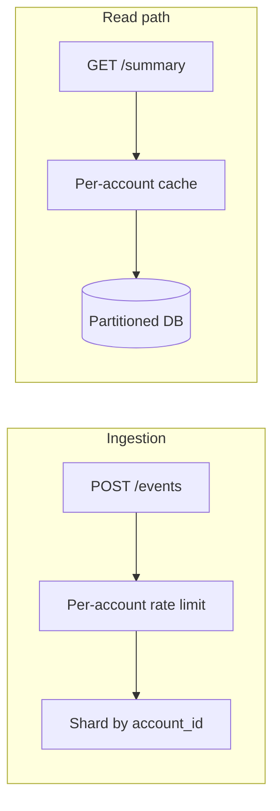
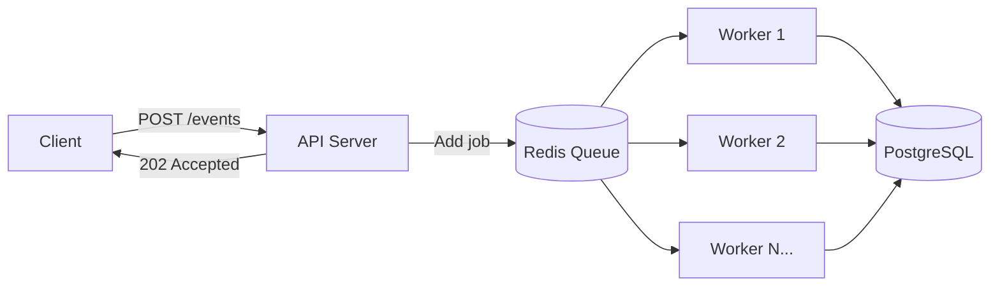

# Design Document: Event Ingestion Platform

Design considerations for: avoiding global hotspots, exposing SLOs to Product/Business, protecting the system from misbehaving tenants, and horizontal scaling.

---

## 1. Avoiding Global Hotspots (e.g. One “Whale” Account)

A single very large or very active account can dominate resources and hurt latency for others. Mitigations:

**Sharding / partitioning by account**

- Partition the `events` table by `account_id` (e.g. hash or range). Each partition (or shard) is isolated so one account’s volume doesn’t saturate a single node.
- Route reads and writes by `account_id` to the correct shard. Summary queries stay local to one shard.

**Per-account rate limits**

- Apply rate limits per `account_id` (in addition to global/IP limits). A “whale” is capped (e.g. X events/min, Y summary req/min), so they cannot monopolize the service.
- Implement via a key like `ratelimit:account:{account_id}` in Redis with a sliding window or token bucket.

**Caching per account**

- Summary cache keys are already per account and window (`summary:{account_id}:{window}`). Hot accounts get cache hits; DB load is bounded.
- Optionally: separate cache pools or TTLs for very large accounts to avoid one account evicting others’ entries.

**Read replicas / separate pools**

- For accounts above a size threshold, route summary reads to dedicated read replicas or a separate connection pool so their heavy queries don’t block others on the primary.

---

## 2. Exposing Meaningful SLOs to Product/Business

**SLIs (what we measure)**

- **Latency:** P50, P95, P99 of `POST /events` and `GET /accounts/:id/summary` (server-side, excluding client).
- **Error rate:** % of requests returning 5xx (or 4xx if we treat e.g. 429 as “degraded”).
- **Availability:** % of successful (2xx) responses over a rolling window (e.g. 30 days).
- **Throughput:** Events ingested per second; summary requests per second (optional).

**Target SLOs (examples)**

- Availability: 99.9% (e.g. monthly).
- Latency: P99 &lt; 500 ms for summary; P99 &lt; 2 s for event ingestion (batch).
- Error budget: 0.1% of requests can “fail” (5xx or timeouts) per month.

**How to expose them**

- **Dashboards:** Grafana (or equivalent) with panels for latency percentiles, error rate, availability, and throughput. Segment by endpoint and, if needed, by account tier.
- **Error budget:** Show “remaining budget” (e.g. 0.1% – actual 5xx rate) and burn rate; alert when budget is consumed too fast.
- **Alerts:** Alert when P99 &gt; target, error rate &gt; threshold, or availability drops below 99.9%. Route to on-call and optionally to a status page.
- **Reports:** Weekly/monthly summary for Product/Business: availability %, P95/P99 latency, top failure reasons, and any breach of SLOs with root cause.

---

## 3. Protecting the System from Misbehaving Tenants

**Per-account rate limiting**

- Limit events per account per minute (and optionally summary requests per account per minute). Clients that exceed the limit receive 429 with `Retry-After` and a clear body (e.g. “Account rate limit exceeded”).
- Prevents one account from flooding ingestion or summary and degrading the service for others.

**Quotas**

- Define daily (or monthly) event volume per account. Track usage (e.g. in Redis or DB); reject or throttle once the quota is reached. Surfaces as 429 or a specific “quota exceeded” response.

**Circuit breaker per account (optional)**

- If an account repeatedly causes errors (e.g. bad payloads, timeouts), temporarily block or throttle that account (e.g. open circuit for N seconds). After cooldown, allow a few requests; if they succeed, close the circuit. Protects the rest of the system from a faulty or abusive client.

**Cost / usage-based back-pressure**

- For very high-volume accounts, apply stricter limits or higher latency (e.g. longer queue delay) so that usage aligns with capacity and fairness. Product can define tiers (e.g. standard vs enterprise) with different limits and guarantees.

**What the client sees**

- **429 Too Many Requests:** Body explains “rate limit exceeded” or “quota exceeded”; `Retry-After` header indicates when to retry.
- **503 Service Unavailable:** When a circuit is open or the system is overloaded; client should retry with backoff.
- **504 Gateway Timeout:** When a request times out (e.g. DB slow); client can retry idempotently where applicable.

---

## 4. Async Event Processing & Horizontal Scaling

**Current Implementation: BullMQ**

The event ingestion pipeline uses BullMQ (Redis-backed queue) for async processing:

1. `POST /events` validates the payload and enqueues a job → returns `202 Accepted` immediately
2. Background workers (`EventsProcessor`) consume jobs and batch-insert into PostgreSQL
3. Workers retry failed jobs automatically (3 attempts with exponential backoff)

**Benefits of async processing:**

- **Decoupled latency:** HTTP response time is independent of DB write time
- **Natural back-pressure:** Queue absorbs traffic spikes; workers process at sustainable rate
- **Fault tolerance:** If DB is temporarily slow/down, jobs remain in queue and are retried
- **Visibility:** Job status, failures, and retries are trackable in Redis

**Horizontal Scaling of Workers**

Workers can be scaled horizontally to increase event processing throughput:

| Scaling Approach | How | Trade-offs |
|------------------|-----|------------|
| **Multiple worker processes** | Run N instances of the app (each has a worker) | Simple; each instance competes for jobs. Redis handles distribution. |
| **Dedicated worker nodes** | Separate deployment for workers (no HTTP server) | API and workers scale independently; better resource isolation. |
| **Concurrency per worker** | Configure BullMQ `concurrency` option (e.g. 5-10 jobs in parallel per worker) | Higher throughput per instance; watch for DB connection pool exhaustion. |
| **Auto-scaling** | Scale worker pods/containers based on queue depth (e.g. Kubernetes HPA on Redis queue length) | Handles variable load; requires monitoring queue metrics. |

**Scaling considerations:**

- **DB connection limits:** Each worker uses connections from the pool. With N workers × M concurrency, ensure `max` pool size can handle it (or use PgBouncer).
- **Redis throughput:** BullMQ is efficient, but very high job rates may need Redis cluster or tuning.
- **Idempotency:** Workers should handle duplicate delivery gracefully (e.g. `orIgnore()` on `event_id` conflict).
- **Ordering:** BullMQ does not guarantee strict ordering across workers. If ordering matters, partition by `account_id` or use a single worker per partition.

**Future improvements:**

- **Separate worker deployment:** Extract `EventsProcessor` into a standalone service for independent scaling
- **Priority queues:** High-priority accounts get processed first
- **Dead-letter queue (DLQ):** Jobs that fail all retries go to a DLQ for manual inspection
- **Metrics:** Expose queue depth, processing rate, and failure rate to Prometheus/Grafana

---

## Summary

| Concern | Approach |
|--------|----------|
| Global hotspots | Sharding by account, per-account rate limits, per-account cache, optional read replicas for large accounts |
| SLOs for Product/Business | SLIs (latency, error rate, availability); target SLOs (e.g. 99.9%, P99 &lt; 500 ms); dashboards, error budget, alerts, reports |
| Misbehaving tenants | Per-account rate limits, quotas, optional per-account circuit breaker, cost-based back-pressure; client sees 429/503/504 and Retry-After |
| Async processing & scaling | BullMQ for async event ingestion; horizontal scaling via multiple workers, concurrency tuning, or auto-scaling on queue depth |
